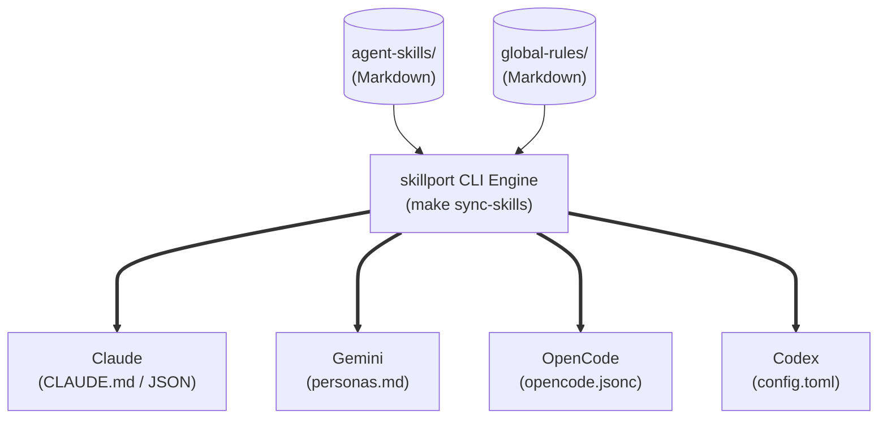

# Project Overview

**プロジェクト名**: Universal AI Agent Configuration System (UAACS)

**目的**:

分散している複数のAIエージェント（Gemini, Claude, Codex, OpenCode）のスキル、プロンプト、ルール設定を単一のソース（Single Source of Truth: SSOT）に統合する。

その際、専用ツールである skillport を中核エンジンとして採用し、メンテナンスコストを最小化しつつ、どのツールでも均一な高次元出力を行える基盤を構築する。

**スコープ**:

* agent-skills/ などの共通ディレクトリ群の整理とSSOT化。
* skillport を用いた、各エージェント（フォーマット違い）へのスキルのエクスポート・配備・同期。
* 各エージェント向けの設定ファイル（JSONC, TOML, Markdown等）へのメタプロンプト・パス注入処理の skillport （および Makefile ラッパー）への移譲。
* ※MCP（Model Context Protocol）の統合は本フェーズではスコープ外とする。

# Tech Stack

| Category | Technology / Tool | Reason / Note |
| :---- | :---- | :---- |
| **ドキュメント記述** | Markdown (.md) | LLMが最も得意とし、人可読性も高いため共通スキルの記述に最適。 |
| **スキル管理 / 同期** | skillport (CLI) | **[NEW Core]** エージェントのスキルを一元管理・変換・各ツールへデプロイするための専用ツール。独自スクリプトを排除し堅牢性を高める。 |
| **ビルド / 自動化** | make (GNU Make) | skillport のコマンドをラップし、既存の _mk/*.mk エコシステムに統合するため。 |
| **補助スクリプト** | Shell Script (bash) | skillport でカバーしきれないエッジケース（特殊なJSONCマージ等）の補助処理用。 |

# Architecture

## Directory Structure (SSOT)

SSOT（正のデータ）となるディレクトリと、各エージェントディレクトリの関係性。

dotfiles-ai/  
├── agent-skills/          <-- [SSOT] 全エージェント共通のスキル定義群 (skillport管理下)  
│   ├── config-modernizer/  
│   ├── agent-skill-architect/  
│   └── ...  
├── global-rules/          <-- [SSOT] コーディング規約や全体ルール等のマークダウン  
├── _mk/                     
│   ├── skillport.mk       <-- [Core] skillportの実行タスク群  
│   └── sync-agents.mk     <-- 統合・同期用タスク定義 (skillportをラップ)  
├── Makefile               <-- ルートMakefile  
│  
├── claude/                <-- Claude用設定  
├── opencode/              <-- OpenCode用設定  
├── gemini/                <-- Gemini用設定  
└── codex/                 <-- Codex用設定

## Data Flow (Skillport Sync Strategy)

# Features & Requirements

### 1. skillport によるスキルの統合・変換機構 (Must Have)

* **入力**: agent-skills/ のディレクトリ群。
* **処理**: skillport の機能を用いて、各AIツールの設定フォーマット（Markdownへのインクルード、JSONへのインジェクト等）に合わせて共通スキル・ルールを変換・展開する。
* **出力**: 各エージェントディレクトリ内に配備された、最適化済みのスキル定義や設定ファイル。

### 2. メタプロンプト (Meta-Prompt) の定義 (Must Have)

* **処理**: プロンプト内で直接ファイルを読み込ませるツール（例：Claude, Gemini CLI）向けに、skillport 経由で以下の「共通テンプレ文字列」をエクスポートする。
* **テンプレート例**: "あなたの拡張スキルやプロジェクトのコーディングルールは ../agent-skills/ および ../global-rules/ に定義されています。タスク実行前に必ずこれらを参照してください。"

### 3. JIT Sync (Makefileラッパー機構) (Should Have)

* **処理**: 開発者が意識せずに同期を行えるよう、Makefile に skillport の実行コマンドを統合する。
* **コマンド**: `make sync-agents` （内部で skillport のビルド/エクスポート処理を呼び出す）
* **制約**: 手動で sed や jq を多用するのではなく、極力 skillport の標準機能に依存する設計とすること。

### 4. レガシー設定ファイルのクリーンアップ (Nice to Have)

* opencode/docs/rules/ などに散らばっている既存の個別ルールファイルを global-rules/ に移行後、古いものを自動削除・クリーンアップするタスク (`make clean-legacy-configs`)。

# Data Structure / Meta-Prompt Schema

SSOTファイル群が遵守すべきフォーマット（LLMがパースしやすく、かつ skillport が処理しやすい構造）。

**Skill File (agent-skills/*/SKILL.md) 構造要件**:

# [Skill Name]
## Objective
## Requirements (Prerequisites)
## Workflow / Steps
1. ...
2. ...
## Output Format

# API Definition (Makefile Commands)

本システムを運用・構築するための make コマンド定義。

| Command | Description |
| :---- | :---- |
| `make sync-agents` | skillport CLIを呼び出し、SSOTのスキル群を各エージェントの設定ファイル・ディレクトリへエクスポート＆同期する。 |
| `make clean-legacy` | 統合後に不要となったツール個別の古いルールファイル・スキルディレクトリを削除する。 |
| `make ai-setup` | 上記すべて（クリーンアップ、同期）を一括実行し、全エージェントの開発環境を最新にする。 |

# LLM Guidelines (For AI Agents/Coders)

この仕様書を読み込んで実装を行うAI（Cursor, Windsurf等）へのガイドライン。

1. **skillport 最優先の原則**: 同期処理やファイルのインジェクト処理（JSON/TOMLの書き換えなど）を自作のBashスクリプトや jq / sed でゴリ押ししないでください。まずは _mk/skillport.mk の内容を確認し、skillport のエコシステム内で解決を図ってください。
2. **SSOTの保護**: 各エージェント（claude/, opencode/等）のディレクトリ内で直接ルールを修正するようなタスクを実行してはなりません。修正は必ず agent-skills/ または global-rules/ に対して行い、その後 make sync-agents を実行してください。
3. **メタプロンプトの活用**: もし skillport の機能のみで完全に設定ファイル（JSONC等）を上書きするのが難しいエッジケースがある場合、設定ファイルへの「ハードコード」を避け、「メタプロンプト（参照指示）」を注入してLLM自身にファイルを読ませる方針に切り替えてください。
